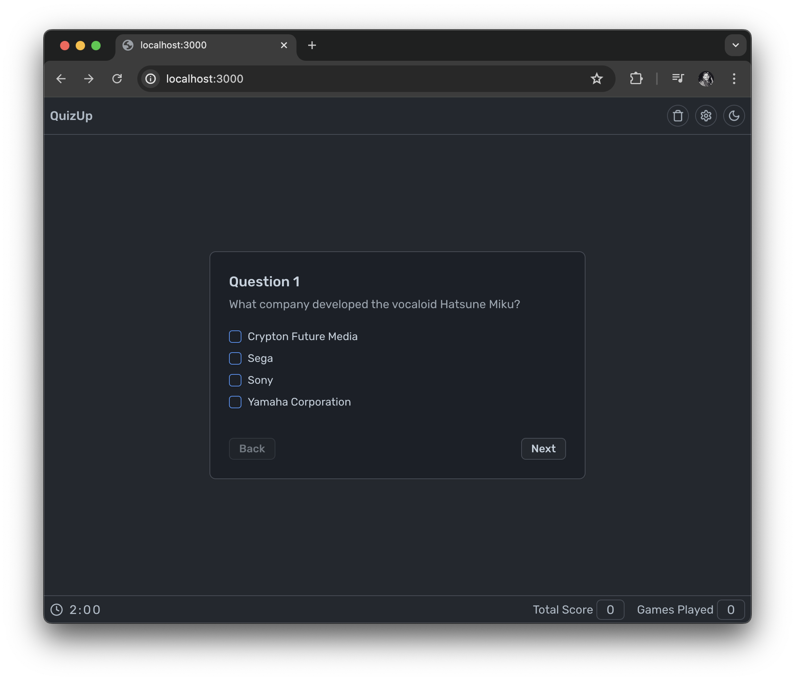

# Nextjs Artwork

- A collection of artwork served by Next.js
- Written in React with [TypeScript](https://www.typescriptlang.org/)
- Responsive, Mobile Friendly, Completely Fluid UI
- Endpoint: Art Institute of Chicago API `/api/artworks`
- Deployment: [Vercel](https://next-artwork.vercel.app/)



## Summary

Return a list of artworks that match your search criteria by using the search bar. Additionally in the header you find filters for public domain and on view fields. If you sensitive to strong bright colors, I have provided a theme switch for you that toggles between light and dark mode. The palette choice is inspired by Github's default dimmed theme.

You can move between results using controls in the bottom of the page with the use of Previous and Next buttons.

Artwork will be listed in the body of the page and is responsive to viewport changes. Any content overflow is scrollable. Clicking a list item will animate toward the center of the grid body. A user can bookmark artworks in the local storage. Framer motion takes care of the transformations. Matching layout elements mount/unmount toward newer sections within our React tree using layout identifiers. I have blurred just the title to hide off a bit of that imperfection in position change.

Shared layout does a great illusion of our list. You may think you have one element moving around but that is not the case.

1. We replace (unmount) the older art card
2. And (mount) a new item where the older card item was placed
3. And then animate the newer item toward its now newer position

Key takeaway: `layoutId` is very powerful and it allows you to become a bit creative with CSS transforms.

More information about an artwork can be viewed within that same overlay. I wanted the user to keep within the same section of the UI, being the Overlay and active card. I feel this is the best way to keep them away from other unwanted navigation.

Bookmarked artworks are displayed separately and can be found in a sidebar that is active from the header. Once the sheet (sidebar) is open, users can pop-off any unwanted items from the list. Its layout position changes are managed by a layout component.

## Functional Requirements
- As a user, I should be able to search artworks
  - The search has a debounce time of `350ms`
  - The search component has a clear button
  - Queries make use of a Next.js API route `server/api.ts`
  - The page makes use of `searchParams`
  - Components: `<Search />` under `components/common`
- Pagination is used to navigate between pages
  - All pagination walks through the same API route `server/api.ts`
  - Animation occurs on page change with a `<MorphText />` component
  - Components: `<Pagination />` under `components`
- Artworks can be filtered by:
  - Public Domain and On View can toggle
  - The buttons make use of `useSearchParams`
  - These fields filter into the `server/api.ts` function
  - Components: `<Controls />` under `components`
- User should be able to select an artwork from the fetched artworks and view details
  - All artworks are presented from containing shared layout component
  - Each artwork list item has a single component
  - A selected `activeArt` artwork is presented in the overlay
  - Components: `<SharedList />`, `<ArtCard />`, `<ArtOverlay />` under `components`
- Selected artwork can be bookmarked in the local storage from the artwork details
  - All bookmarks are stored in the local storage under `bookmarks`
  - I am making use of a `useLocalStorage` hook
  - Bookmarked artwork can be un-bookmarked
  - Bookmarked artworks are presented separately in the sidebar component
  - Components: `<BookmarkCart />`, `<Sidebar />` under `components`

## Technical requirements
- App is based on Next.js ✅
- All components have a clear type interface ✅
- State and view of the app are separated ✅
  - Manage local storage using hooks under `use-hooks-ts` 😬
    - I am hoping that is not a problem 🙏
  - Manage search queries via hooks under `lib/hooks` ✅
  - Grid layout is using state management via Zustand ✅
  - Theme management is using Provider ✅
  - See state under `state/context` and `state/zustand` ✅
- Static types are used to ensure soundness of the app ✅
  -  See definitions in `lib/definitions.ts` ✅
- App has relevant tests
  - Basic navigation tests ✅
  - Basic component tests ✅
  - Outstanding testing for mocking API response 😬
- Minimum required documentation is provided ✅
- Source code is presented on GitHub ✅
- Redux is not used ✅
- No component is being used ✅

## Bonus points
- App is enhanced with supportive animations using Framer motion ✅
- App uses persistence and cache management provided by Next.js ✅
-  App is published as a working demo on a public URL ✅

## Geo finder function

- The supported countries are Germany, France, The Netherlands, and Poland ✅
- The function can be found under `server/geo-finder.ts` ✅

## Outstanding (needed more time)
- Additional testing using mock response data and insertion
- Testing of geo-finder with cypress
- I feel the objective maybe was to create my own storage context
- The application can be broken down into smaller client chunks

Regards, <br />
Luigi Lupini <br />
<br />
I ❤️ all things (🇮🇹 / 🛵 / ☕️)<br />

### Getting Started

```bash
npm install
npm run dev
```

Open [http://localhost:3000](http://localhost:3000) with your browser to see the result.

For cypress testing e2e navigation and common components that all reside under `cypress` folder within the project root. Please ensure the local server is running first for the little e2e demo.


Then run: `npm run cypress open` in the root folder of your project.

### Local Build Results

```bash
next build
   ▲ Next.js 14.1.3

   Creating an optimized production build ...
 ✓ Compiled successfully
 ✓ Linting and checking validity of types
 ✓ Collecting page data
 ✓ Generating static pages (5/5)
 ✓ Collecting build traces
 ✓ Finalizing page optimization

Route (app)                              Size     First Load JS
┌ λ /                                    9.51 kB         146 kB
└ ○ /_not-found                          882 B          85.3 kB
+ First Load JS shared by all            84.4 kB
  ├ chunks/69-6888cb0bb0ab02ba.js        29 kB
  ├ chunks/fd9d1056-04dffe36a95c2f63.js  53.4 kB
  └ other shared chunks (total)          1.99 kB


○ (Static)   prerendered as static content
λ  (Dynamic)  server-rendered on demand using Node.js
```

## Short Walk Through

- Step 1


- Step 2


- Step 3

