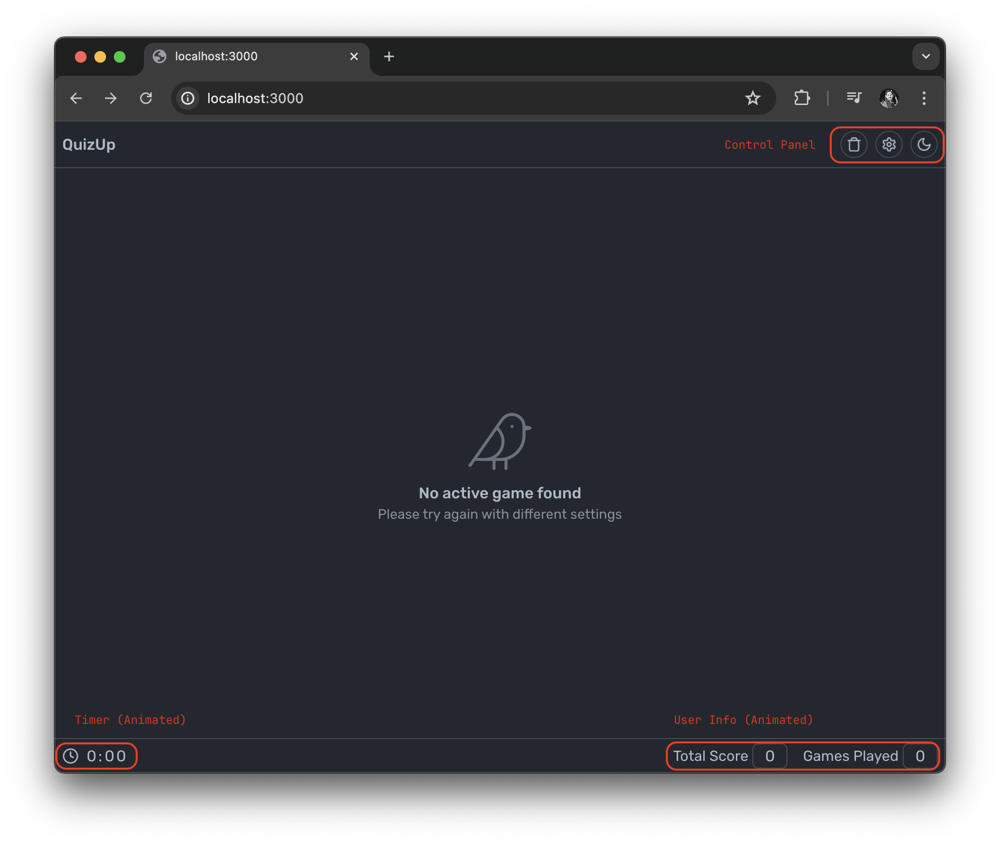

# Nextjs Quiz App

- A dynamic quiz application built with Next.js
- Written in React with [TypeScript](https://www.typescriptlang.org/)
- Responsive, Mobile Friendly, Fluid UI
- Features multiple question types and timed quizzes
- Deployment: [Vercel](https://next-quiz-app-demo.vercel.app/)



## Summary

Test your knowledge with our engaging quiz application! Navigate through questions using the controls at the bottom of each card.

If you sensitive to strong bright colors, I have provided a theme switch for you that toggles between light and dark mode. The palette choice is inspired by Github's default dimmed theme.

Each question appears in a smooth animated layout, ensuring a visually appealing experience. Your progress is saved, and you can review your answers before submitting. Quizzes are stored locally for easy access persisted data.

Framer motion takes care of the transformations. Matching layout elements mount/unmount toward newer sections within our React tree using layout identifiers. Shared layout does a great illusion of our list. You may think you have one element moving around but that is not the case.

1. We replace (unmount) the older art card
2. And (mount) a new item where the older card item was placed
3. And then animate the newer item toward its now newer position

Key takeaway: `layoutId` is very powerful and it allows you to become a bit creative with CSS transforms.

## Functional Requirements
- As a user, I can start a quiz
  - You can load a quiz with a specified number of questions
  - A quiz timer will give a user 1 minute per question
  - Actions with zod assist with server form validation under `server/api`
  - Components: `<ConfigSheet />` under `components/settings`
- Navigate through quiz questions
  - Layout changes are smooth between previous and next questions
  - A use measure hook ensures that the size change is dynamic
  - Navigate through questions using Back and Next buttons
  - Components: `<Carousel />` under `components/carousel`
- Answering quiz questions
  - Questions can be multiple choice or true/false
  - A zustand store handles all the business logic and is persisted
  - Components: `<useQuizStore />` under `state/zustand`
- Review and submit quiz answers
  - Users can review answers before submitting
  - Score and detailed results are displayed by slots
  - Components: `<Review />`, `<Complete />` under `components/carousel/slot`

## Technical requirements
- App is based on Next.js ✅
- All components have a clear type interface ✅
- State and view of the app are separated ✅
  - Manage local storage using `zustand/middleware` ✅
  - Manage timer via a helpful hook under `lib/hooks` ✅
  - Grid layout is using (server-side) state with zustand ✅
  - Theme management is using Provider ✅
  - See provider tree under `state/context` and `state/zustand` ✅
- Static types are used to ensure soundness of the app ✅
  -  See definitions in `lib/definitions.ts` ✅
- App has relevant tests
  - Basic navigation tests ✅
  - Basic component tests ✅
  - Outstanding testing for mocking API response 😬
- Minimum required documentation is provided ✅
- Source code is presented on GitHub ✅
- App is enhanced with supportive animations using Framer motion ✅
- App uses persistence and cache management provided by Next.js ✅
- App is published as a working demo on a public URL ✅

## Outstanding (needed more time)
- Additional testing using mock response data and insertion
- Authentication to ensure session is managed within the application

Regards, <br />
Luigi Lupini <br />
<br />
I ❤️ all things (🇮🇹 / 🛵 / ☕️)<br />

### Getting Started

```bash
npm install
npm run dev
```

Open [http://localhost:3000](http://localhost:3000) with your browser to see the result.

For cypress testing e2e navigation and common components that all reside under `cypress` folder within the project root. Please ensure the local server is running first for the little e2e demo.


Then run: `npm run cypress open` in the root folder of your project.

### Local Build Results

```bash
$ next build
   ▲ Next.js 14.1.3

   Creating an optimized production build ...
 ✓ Compiled successfully
 ✓ Linting and checking validity of types
 ✓ Collecting page data
 ✓ Generating static pages (5/5)
 ✓ Collecting build traces
 ✓ Finalizing page optimization

Route (app)                              Size     First Load JS
┌ ○ /                                    46.6 kB         179 kB
└ ○ /_not-found                          0 B                0 B
+ First Load JS shared by all            84.3 kB
  ├ chunks/69-0abad9b0e8f68927.js        29 kB
  ├ chunks/fd9d1056-95560a19744a4975.js  53.4 kB
  └ other shared chunks (total)          1.96 kB


○  (Static)  pre-rendered as static content
```

## Short Walk Through

- Step 1


- Step 2


- Step 3


- Step 4


- Step 5


- Step 6

